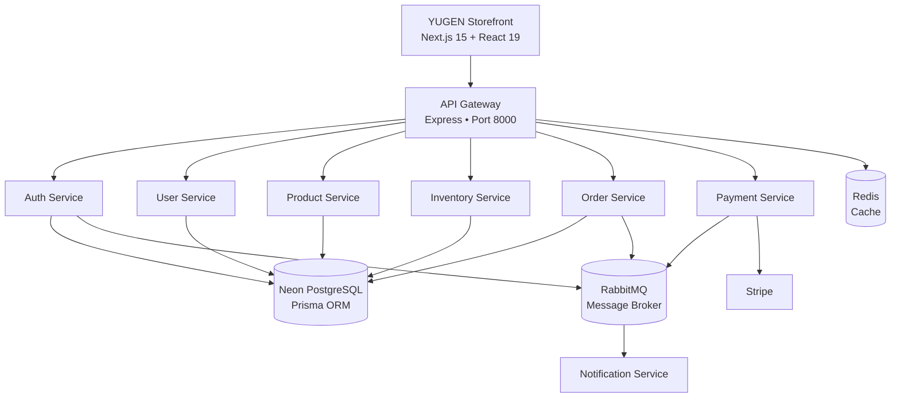

# YUGEN

### **Quiet luxury. Thoughtfully engineered.**

<p align="center">
  
</p>

<p align="center">
  <strong>A cinematic fashion commerce experience powered by a modern microservices architecture.</strong>
</p>

<p align="center">
  <a href="#-experience">Experience</a> •
  <a href="#-architecture">Architecture</a> •
  <a href="#-tech-stack">Tech Stack</a> •
  <a href="#-getting-started">Getting Started</a>
</p>

<p align="center">


</p>

<p align="center">
  <a href="https://clothing-ecommerce-five-pi.vercel.app">
    
  </a>
</p>

---

## 01 — The Idea

> **YUGEN is more than an online clothing store.**
>
> It is a digital interpretation of quiet luxury — where restrained visuals, editorial storytelling and seamless commerce meet a scalable engineering foundation.

YUGEN combines a **premium fashion storefront** with a **production-oriented microservices backend**, creating an experience designed to feel as refined as the products it presents.

**Less noise. More intention.**

---

# ✦ Experience

## 🖤 A Storefront Designed Like an Editorial

YUGEN transforms traditional e-commerce into a visual fashion experience.

### Cinematic Home

* Full-screen campaign hero
* Video-driven storytelling
* Editorial collection sections
* "Grace in Every Thread"
* "Effortless Style"
* Brand philosophy & values
* Interactive lookbook

### Curated Collections

Explore fashion through:

* Men's Collection
* Women's Collection
* New Arrivals
* Categories
* Search
* Advanced filtering
* Product recommendations

---

## 🛍️ Product Experience

Every product is presented through a detailed product experience.

**Product Detail Page**

* High-resolution image gallery
* Multiple product variants
* Size selection
* Color swatches
* Live stock indicators
* Pricing & tax breakdown
* Delivery information
* Product details
* Reviews
* Wishlist actions
* Add-to-cart interactions

---

## ⚡ Search & Discovery

A fast, multi-term search experience helps customers discover products without friction.

**Filtering**

`Category` · `Gender` · `Size` · `Color` · `Price` · `Availability`

Search results dynamically display:

* Product counts
* Category counts
* Filter states
* Sorting
* Product grids
* Pagination

---

## 🛒 Commerce Flow

From discovery to delivery, the entire shopping journey is connected.

```text
Discover
   ↓
Product
   ↓
Wishlist / Cart
   ↓
Checkout
   ↓
Payment
   ↓
Order
   ↓
Tracking
   ↓
Delivered
```

Customers can:

* Adjust cart quantities
* Apply coupon codes
* Manage shipping addresses
* Select payment methods
* Place orders
* View order history
* Track shipments
* Manage saved products

---

# 👑 Admin Command Center

YUGEN also includes a dedicated administration experience.

### Analytics

Monitor the health of the store through:

* Revenue metrics
* Sales statistics
* Order breakdown
* Customer insights
* Product performance

### Product Management

Complete catalog control:

* Create products
* Update products
* Delete products
* Manage variants
* Adjust pricing
* Control inventory
* Organize categories

### Order Management

Manage the complete fulfillment lifecycle:

```text
Pending
   ↓
Processing
   ↓
Shipped
   ↓
Delivered
```

Administrators can also assign tracking numbers and update order states.

### Customer Directory

* Customer profiles
* Account status
* Transaction history
* Customer management

---

# ⚙️ Architecture

YUGEN is built around a **microservices architecture** designed to keep individual business domains isolated, scalable and maintainable.



### Why microservices?

Each major business capability has its own responsibility.

| Service          | Responsibility                 |
| ---------------- | ------------------------------ |
| **API Gateway**  | Central API entry point        |
| **Auth**         | Registration, login & JWT      |
| **User**         | Profiles, addresses & wishlist |
| **Product**      | Catalog & categories           |
| **Inventory**    | Stock & reservations           |
| **Order**        | Checkout & order lifecycle     |
| **Payment**      | Stripe payments & refunds      |
| **Notification** | Transactional emails           |

This separation makes the system easier to:

* Scale independently
* Deploy independently
* Debug
* Maintain
* Extend with new services

---

# 🧩 Tech Stack

### Frontend

| Technology        | Purpose               |
| ----------------- | --------------------- |
| **Next.js 15**    | Application framework |
| **React 19**      | UI architecture       |
| **TypeScript**    | Type safety           |
| **Tailwind CSS**  | Styling system        |
| **Framer Motion** | Motion & interactions |
| **Lucide**        | Interface icons       |

### Backend

| Technology     | Purpose             |
| -------------- | ------------------- |
| **Node.js**    | Runtime             |
| **Express**    | Microservices       |
| **Prisma**     | ORM                 |
| **PostgreSQL** | Primary database    |
| **Neon**       | Cloud PostgreSQL    |
| **Redis**      | Caching             |
| **RabbitMQ**   | Messaging           |
| **JWT**        | Authentication      |
| **Stripe**     | Payments            |
| **Nodemailer** | Email notifications |

---

# ✨ Dual-Mode Frontend

One of the most useful parts of YUGEN is its **dual-mode API architecture**.

The unified API client can operate in two modes.

### LIVE MODE

```text
Next.js
   ↓
API Client
   ↓
API Gateway
   ↓
Microservices
   ↓
Database
```

### FALLBACK MODE

If the backend is unavailable:

```text
Next.js
   ↓
API Client
   ↓
Local Storage
   ↓
Static Catalog
```

This means the storefront remains functional during frontend development even when the backend isn't running.

> **Frontend development shouldn't stop because a backend service is offline.**

---

# 📁 Project Structure

```text
clothing-ecommerce/
│
├── app/
│   ├── (auth)/
│   ├── admin/
│   ├── products/
│   ├── category/[slug]/
│   ├── men/
│   ├── women/
│   ├── cart/
│   ├── checkout/
│   ├── orders/
│   ├── profile/
│   ├── wishlist/
│   ├── search/
│   └── ...
│
├── components/
│   ├── admin/
│   └── yugen/
│
├── data/
│   └── catalogProducts.ts
│
├── database/
│   ├── dataset/
│   ├── prisma/
│   └── sql/
│
├── backend/
│   ├── api-gateway/
│   ├── auth-service/
│   ├── user-service/
│   ├── product-service/
│   ├── inventory-service/
│   ├── order-service/
│   ├── payment-service/
│   └── notification-service/
│
├── public/
│   └── assets/
│
├── docker/
│
├── docker-compose.yml
├── render.yaml
├── next.config.ts
├── tailwind.config.ts
└── package.json
```

---

# 🚀 Getting Started

## Requirements

Before starting, make sure you have:

* Node.js **18+**
* npm or yarn
* Git
* Docker & Docker Compose *(optional)*

---

## 1. Clone

```bash
git clone https://github.com/zaaraf027-glitch/clothing-ecommerce.git

cd clothing-ecommerce
```

## 2. Install

```bash
npm install
```

## 3. Start the frontend

```bash
npm run dev
```

Then open:

```text
http://localhost:3000
```

### No backend required

The frontend includes a static dataset and local-storage fallback, so the core storefront experience can be explored without starting the microservices.

---

# 🐳 Full Stack with Docker

To launch the complete infrastructure:

```bash
docker-compose up --build
```

This starts the required services including:

* API Gateway
* Backend microservices
* PostgreSQL
* Redis
* RabbitMQ

---

# 🔐 Demo Access

The application includes Quick-Fill authentication for development and demonstration.

| Role         | Email                | Password           |
| ------------ | -------------------- | ------------------ |
| **Admin**    | `admin@yugen.com`    | `Admin@Yugen2026!` |
| **Customer** | `customer@yugen.com` | `Customer@2026!`   |

> ⚠️ These credentials are for local/demo environments only. Never use demo credentials in production.

---

# 🧪 Quality Checks

Run these commands before pushing changes:

### Type Check

```bash
npx tsc --noEmit
```

### Lint

```bash
npm run lint
```

### Production Build

```bash
npm run build
```

### Production Server

```bash
npm run start
```

---

# 🗺️ Roadmap

### Completed

* [x] Cinematic storefront
* [x] Men & Women collections
* [x] Product catalog
* [x] Advanced filtering
* [x] Product detail experience
* [x] Search
* [x] Cart
* [x] Wishlist
* [x] Checkout
* [x] Authentication
* [x] Order history
* [x] Order tracking
* [x] Admin dashboard
* [x] Product management
* [x] Inventory management
* [x] Microservices architecture
* [x] Redis caching
* [x] RabbitMQ messaging
* [x] Prisma + PostgreSQL

### Next

* [ ] Advanced product recommendations
* [ ] AI-powered style discovery
* [ ] Advanced analytics
* [ ] Automated inventory alerts
* [ ] Multi-region deployment
* [ ] Observability & distributed tracing
* [ ] Automated end-to-end testing

---

# 📸 Experience YUGEN

> **A quiet interface for a bold wardrobe.**

YUGEN is designed around a simple principle:

**Technology should disappear behind the experience.**

The customer shouldn't think about APIs, services, queues or databases.

They should simply discover.

Choose.

Wear.

---

# 🤝 Contributing

Contributions, ideas and improvements are welcome.

```text
Fork
 ↓
Create a branch
 ↓
Make your changes
 ↓
Run verification
 ↓
Open a Pull Request
```

Please keep the visual language and engineering conventions consistent with the existing project.

---

# 📄 License

This project is licensed under the **MIT License**.

---

<p align="center">

### **YUGEN**

*Designed quietly. Built deliberately.*

<br/>

**Quiet luxury, engineered for the modern web.**

</p>
